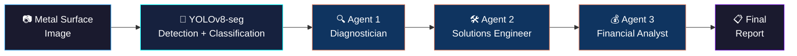

<div align="center">

# 🔩 SurfaceIQ

### 🎯 Automated Metal Surface Defect Detection & AI-Driven Decision Pipeline

<p>
  
  
  
  
</p>

<p>
  
  
  
</p>

**🔍 Detect &nbsp;→&nbsp; 🧠 Diagnose &nbsp;→&nbsp; 🛠️ Solve &nbsp;→&nbsp; 💰 Decide**

</div>

<br>

## 📖 What is FerroVision?

**FerroVision** is an end-to-end pipeline for automated metal surface defect inspection, combining computer vision with AI-driven reasoning. A fine-tuned **YOLOv8 segmentation model** detects and classifies surface anomalies — scratches, pitting, rolled-in scale, inclusions, and other defect types — directly on industrial metal imagery, outputting precise **polygon masks** rather than just bounding boxes.

But detection is only half the picture. Every flagged anomaly is passed into a **multi-agent reasoning system** built with LangGraph, where three specialized agents collaborate in sequence to turn a raw detection into a decision-ready report.

<br>

## ⚙️ How it Works



| Stage | What Happens |
|---|---|
| 🎯 **Detection** | YOLOv8-seg scans the image and outputs polygon masks, class labels, and confidence scores for every anomaly found |
| 🔍 **The Diagnostician** | Interprets the raw detection into an engineering explanation — what the defect physically is, its likely root cause, and how severe it looks |
| 🛠️ **The Solutions Engineer** | Proposes concrete remediation steps, from immediate fixes to preventive process changes, along with an urgency rating |
| 💰 **The Financial Analyst** | Weighs the cost of fixing the defect against the cost of letting it ship, and closes the loop with a clear recommendation: fix now, defer, or reject the part |

The result is a system that doesn't just flag *"something's wrong here"* — it explains **what's** wrong, **how** to fix it, and **whether** fixing it is worth it.

<br>

## ✨ Features

- 🎯 **Polygon-level defect segmentation** — not just bounding boxes, actual pixel-precise masks
- 🏷️ **Multi-class anomaly classification** — scratches, pitting, rolled-in scale, inclusions, and more
- 🤖 **3-agent LangGraph reasoning pipeline** — diagnosis → solution → financial viability
- 📊 **Roboflow-native dataset workflow** — download, version, and retrain with one config change
- 📄 **Auto-generated markdown reports** — decision-ready output per inspected image

<br>

## 📋 Sample Output

```markdown
# Metal Surface Anomaly Report
**Image:** sample_part_014.jpg

## Detections (YOLO)
- pitting (confidence 0.91, covers 4.2% of image area)
- scratch (confidence 0.78, covers 1.1% of image area)

## 1. Problem Diagnosis
...

## 2. Recommended Solution
...

## 3. Financial Assessment
...
```

<br>

## 🚀 Quick Start

```bash
git clone https://github.com/yourusername/ferrovision.git
cd ferrovision
pip install -r requirements.txt
cp .env.example .env   # add your ROBOFLOW_API_KEY and ANTHROPIC_API_KEY

python download_dataset.py
python train.py --data ./data/data.yaml --model yolov8x-seg.pt --epochs 100
python main.py --image ./samples/part_01.jpg
```

<br>

## 🧱 Tech Stack

| Layer | Tool |
|---|---|
| 🎯 Detection & Segmentation | Ultralytics YOLOv8-seg |
| 📊 Dataset Management | Roboflow |
| 🤖 Multi-Agent Orchestration | LangGraph |
| 🧠 Reasoning Engine | Claude (Anthropic API) |

<br>

## 📂 Project Structure

```
ferrovision/
├── agents/
│   ├── state.py         # shared LangGraph state schema
│   ├── nodes.py          # Diagnostician / Solutions / Financial agents
│   └── graph.py            # graph wiring
├── download_dataset.py    # pulls dataset from Roboflow
├── train.py                 # YOLOv8-seg training
├── infer.py                   # structured detection output
├── main.py                     # end-to-end pipeline entrypoint
└── requirements.txt
```

<br>

## 🗺️ Roadmap

- [ ] ⏭️ Conditional routing — skip the financial agent for cosmetic-only defects
- [ ] ⚡ Parallel agent execution instead of sequential
- [ ] 🖥️ Streamlit dashboard for live image upload + report viewing
- [ ] 🎥 Batch/video inspection support

<br>

<div align="center">

**Made with 🔩 and a bit too much curiosity about rust 🦀**

</div>
